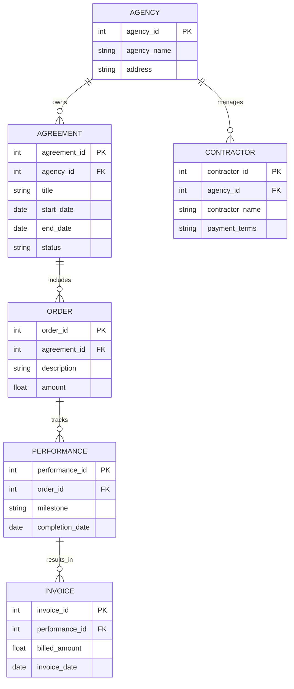

```mermaid
erDiagram
    AGENCY ||--o{ AGREEMENT : owns
    AGREEMENT ||--o{ ORDER : includes
    ORDER ||--o{ PERFORMANCE : tracks
    PERFORMANCE ||--o{ INVOICE : results_in
    AGENCY ||--o{ CONTRACTOR : manages

    AGENCY {
        int agency_id PK
        string agency_name
        string address
    }

    AGREEMENT {
        int agreement_id PK
        int agency_id FK
        string title
        date start_date
        date end_date
        string status
    }

    ORDER {
        int order_id PK
        int agreement_id FK
        string description
        float amount
    }

    PERFORMANCE {
        int performance_id PK
        int order_id FK
        string milestone
        date completion_date
    }

    INVOICE {
        int invoice_id PK
        int performance_id FK
        float billed_amount
        date invoice_date
    }

    CONTRACTOR {
        int contractor_id PK
        int agency_id FK
        string contractor_name
        string payment_terms
    }
```
